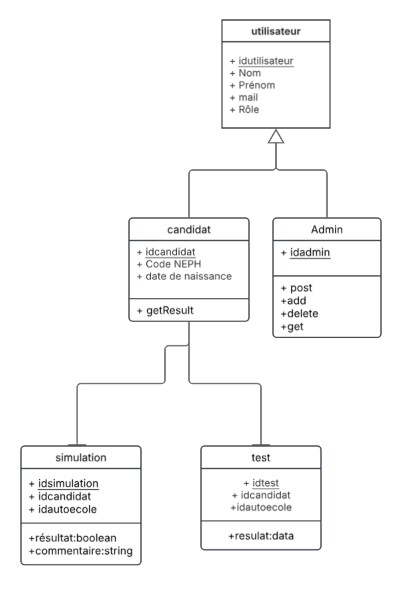

# SAE401
# **SAZ'DRIVE**

## **Membres** 

- Abi Vigneswaran
- Zeinabou Bal
- Sheinez Ben Backer
  
---

### **Lien vers le projet hébergé**

Notre site **SAZ'DRIVE** sera hébergé prochainement, des modifications sont en cours afin d'avoir l'ensemble des fonctionnalités :  

---

### **Présentation de SAZ'DRIVE, nom de la plateforme qui a été au départ EASY2DRIVE** 

**SAZ'DRIVE** est une plateforme permettant aux élèves d'observer leurs résultats de leurs entraînements de code, afin qu'ils puissent mieux progresser pour obtenir le code de la route. La plateforme permet aussi aux auto-écoles d'inscrire des élèves et de leur affecter un formateur qui suivra leur formation.

SAZ'DRIVE est une plateforme avec plusieurs fonctionnalités : 
  
- **PAGE ÉLÈVE** : Elle permet aux élèves de visualiser leurs résultats de leurs entraînements et du code de la route, le tout, dans les meilleures conditions avec des statistiques. De plus, l'élève peut observer l'ensemble de ses résultats avec un historique intégré au sein de son tableau de bord. 

- **PAGE ADMIN, L'AUTO-ÉCOLE** : La page admin offre la possibilité d'ajouter des utilisateurs au sein de la plateforme SAZ'DRIVE. Ajouter de nouveaux élèves pour qu'ils puissent observer l'intégralité de leurs résultats en détail. De plus, l'admin a accès à la modification d'un profil d'un élève et il a la possibilité d'en supprimer. L'administrateur, une fois qu'il observe que l'élève réussit ses examens avec un pourcentage de 80%, lui offre la possibilité de lui donner un formateur d'ici peu.

- **PAGE AVIS** : Les élèves ont la possibilité d'écrire des avis et commentaires concernant la plateforme SAZ'DRIVE, des avis qui permettront à la plateforme de s'améliorer. Les admins ont la possibilité de supprimer les avis en cas de message indésirable.

- **DIAGRAMME DE CLASSE**

  

---

#### **Comment s'est déroulée l'organisation de ce projet ?**

- Le projet aura duré plus d'un mois et deux semaines. L'organisation s'est faite via Notion. Nous avons réalisé une méthode Kanban avec toutes les tâches qui ont été attribuées.

- La communication, la cohésion et l'esprit d'équipe ont été présents au sein de l'équipe afin de réussir ce projet. Des réunions et des retours ont été faits à chaque fois que nous devions nous y mettre. Lorsque l'un des membres rencontrait des difficultés, il était de notre mission à tous les autres membres de l'aider.
  
---

#### **Répartition des tâches**

**Sheinez Ben Backer : Chef de projet, Développeur Back-End, Développeur Front**

- Organisation et meneur du projet.  
- Développement des pages en front-end.
- Gestion du projet d'Angular  
- Conception du modèle MCD.
- Liaison entre la BDD et le front.  
- Conception de la base de données. 

**Abi Vigneswaran : Développeur Front, Designer Graphique, UI/UX Designer**

- Création du logo SAZ'DRIVE
- Création des maquettes des pages du site.  
- Conception du moodboard et de la charte graphique.  
- Gestion du projet d'Angular  
- Développement des pages en front-end.  

**Zeinabou : Développeur Back-End, UI/UX Designer, Designer Graphique, Hébergement API**
 
- Conception du design system.  
- Conception de la base de données.  
- Conception de la voiture en 3D
- Hébergement API. 
- Conception du modèle MCD.

---

###### **Langages utilisés**

- **Langages de programmation** : HTML, CSS, JavaScript, TypeScript.
- **Framework** : Angular
- **Bibliothèques** : Bootstrap, Chart.js  
- **Création des maquettes et leur charte graphique** : [Figma](https://www.figma.com/design/9rQdWT5s8afsK3b3ae3Sse/SAE-401?node-id=0-1&t=jHJJNT9yNxC5lC07-1)
- **Développement** : Visual Studio Code.  

---

###### **Résultats obtenus**

**Nos réussites**

- Notre équipe est actuellement sur le point de finaliser le projet. Les éléments et les attentes que nous avons eus entre membres ont été répondus et sont en cours de finalisation pour les fonctionnalités des acteurs du site.
  
- Les pages codées en front ressemblent de très près à la maquette du site. 
  
- Nous avons rendu la plupart des éléments responsives, ce qui donne la possibilité de visualiser notre projet sur une version mobile.

**Difficultés rencontrées** 

 - Nous avons rencontré des difficultés concernant l'hébergement de ce travail, ce qui était un imprévu. Cela nous a empêchés de finaliser le site dans les temps demandés.

- La liaison entre la base de données et le front a été difficile, ce qui nous as empêcher de réaliser certaines fonctionalités demandés, nous sommes actuellement en train de régler les derniers problèmes.

**Conclusion**

Le projet **SAZ'DRIVE** nous a permis de gagner en expérience dans le métier de développement web, mais aussi dans l'organisation d'un projet intéressant. Ce projet nous a fait comprendre l'utilisation d'Angular tout en acquérant de nouvelles compétences en TypeScript, et en développant encore mieux notre expertise en design, en développement front et back. Mais aussi sur la modélisation 3D, le design et le travail en groupe.
